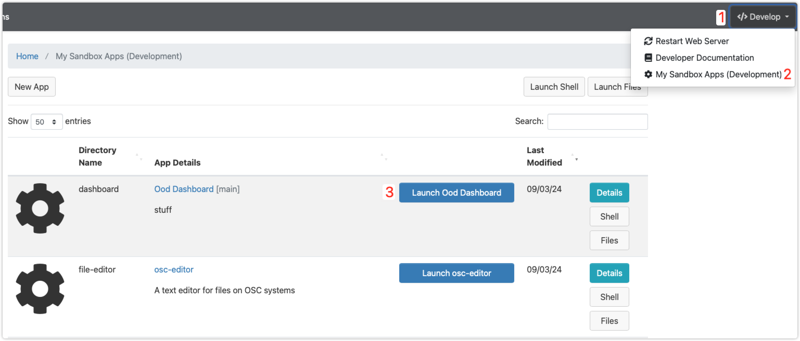

# Anvil Supercomputer Dashboard

## About

The [Anvil Dashboard](https://www.rcac.purdue.edu/anvil), powered by [Open OnDemand](https://openondemand.org/), provides researchers a user-friendly graphical interface to access Anvil resources.

## Enabling Developer Mode
[Enable Developer Mode Guide](https://osc.github.io/ood-documentation/latest/tutorials/tutorials-dashboard-apps.html)


## Installation

> Note: These installation instructions are solely for development use, not production deployment.

### 1. SSH into a login node

```bash
ssh username@login-node-hostname
```

### 2. Install dashboard using installation script

**Use git to clone the repository into your home directory** and then run the installation script:

- Using SSH
    > To use SSH for `git clone`, you must first set up a [Github SSH key](https://docs.github.com/en/authentication/connecting-to-github-with-ssh/adding-a-new-ssh-key-to-your-github-account) on [Github](https://github.com/settings/keys).
    ```bash
    git clone git@github.com:richtan/Anvil-OOD-Dashboard.git $HOME/ondemand/dev/dashboard && cd $HOME/ondemand/dev/dashboard && ./install.sh
    ```

### 3. Open the dashboard



1. Click on Develop dropdown in top right.
2. Click on My Sandbox Apps (Development)
3. Click on Launch Ood Dashboard next to the app called Ood Dashboard \[main\]
